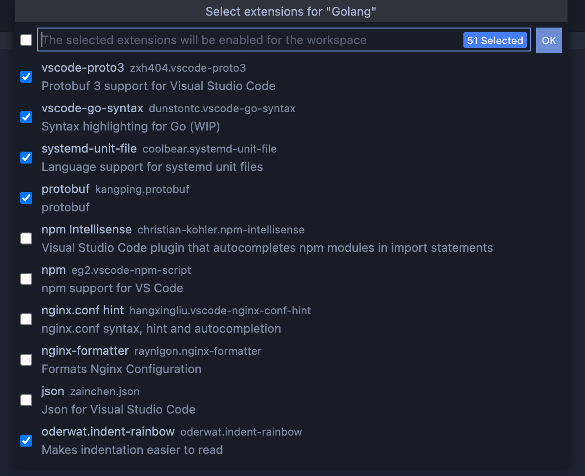
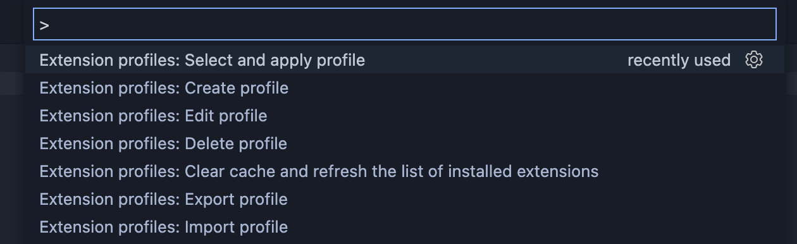

[fork自](https://github.com/evald24/vscode-extensions-profiles)，由于原作者把仓库设置成了只读状态，所以我就在这加了些功能。主要就是加了云端同步的功能，设置好了gist即可使用。

##### 同步流程：

1. 在vscode中按下F1
2. 输入 init Sync profile 命令设置好 gist
3. 第一次同步时，请先使用 Upload profile 命令上传配置信息
4. 在另一台需要同步的电脑中，按照1和2的步骤，设置好同样的 gist，
5. 使用 Download profile 命令下载已经在步骤3中上传的配置
6. 后续每次要更新时，重复3、5步骤

english version：

------

[fork from](https://github.com/evald24/vscode-extensions-profiles)，Since the original author set the repository to read-only, I added some features here. The main addition is the cloud sync feature, which can be used by setting up a gist.

##### Sync Process:

1. Press F1 in VS Code.
2. Enter the command init Sync profile to set up the gist.
3. For the first sync, please use the Upload profile command to upload the configuration.
4. On another computer that needs to be synced, follow steps 1 and 2 to set up the same gist.
5. Use the Download profile command to download the configuration that was uploaded in step 3.
6. For future updates, repeat steps 3 and 5.

以下是原文：

------

# Extension profiles for VSCode

Lets you create profiles to include the selected extensions in the desired project.

Do you often have to work with different projects and different technologies?

<!-- https://user-images.githubusercontent.com/10986227/122539241-34165180-d049-11eb-8a35-dbd3402e991f.mp4 -->

Quickly and conveniently create profiles with the necessary extensions for working with various technologies.

Apply a profile to a folder or workspace with a single command!

## Further development

Explanation: 💡 - pending, ⚙️ ️- in progress, ❌ - cancelled, ✅ - done

In parentheses are those who proposed this idea:

- 💡 Apply a profile to a set of selected workspaces;
- ✅ Global profile ([drod3763](https://github.com/evald24/vscode-extensions-profiles/issues/1#issuecomment-895592733), [jlongo](https://github.com/evald24/vscode-extensions-profiles/issues/1#issuecomment-950224588));
- ✅ Import selected profiles;
- 💡 Multiple (combine) apply of profiles ([lakuapik](https://github.com/evald24/vscode-extensions-profiles/issues/1#issuecomment-876195053));
- 💡 Recommendations for installing missing extensions;
- 💡 Convenient management of extensions for a separate project without linking to a profile or creating it;
- 💡 Create a profile from the current or selected project;
- ✅ Multiply delete profiles;
- ✅ UI to switch profiles, a dropdown box on the bottom status bar ([dnmalenke](https://github.com/evald24/vscode-extensions-profiles/issues/1#issuecomment-1058163192)).

I invite you to discuss these thoughts and suggestions in this issue: [Do I need additional functionality?](https://github.com/evald24/vscode-extensions-profiles/issues/1)
